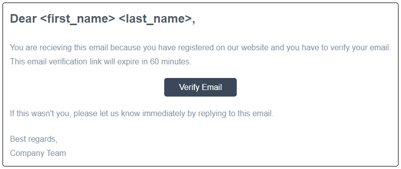
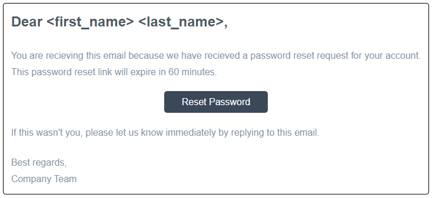
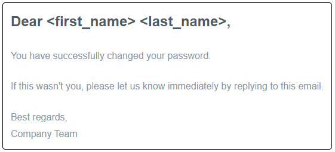

# NestJS Template

---

### Table of Contents

- [Description](#description)
- [Technologies](#technologies)
- [How To Use](#how-to-use)
    - [Installation](#installation)
    - [Database](#database)
    - [Setup environment variables](#setup-environment-variables)
    - [Run the application](#run-the-application)
    - [Tests](#tests)
    - [Access](#access)
- [Premade Modules](#premade-modules)
- [Author Info](#author-info)

---

### Description

This is a template for NestJS applications. It includes the following features/packages:
Fastify platform, TypeORM with PostgreSQL, JWT authentication with passport, swagger documentation and git.
It also includes two premade moduls 
- Auth Module -> register, verify-email, login, refresh access token, logout and reset password.
- Quote Module -> get, create, update and delete quotes with proper auth.

---

### Technologies

- NestJS
- Fastify
- TypeORM
- Typescript
- PostgreSQL
- JWT
- Nodemailer
- Swagger
- Env
- Git

---

### How To Use

#### Installation

Follow these instructions to install and setup the application

```bash
# Clone repository
$ git clone https://github.com/dadolyner/NestJS-template
```

```bash
# Install NestJS CLI
$ npm install -g @nestjs/cli npm-check-updates

# Update NestJS CLI to the latest version
$ nest update
# or
$ nest update --force
```

```bash
# Install dependencies
$ npm i
```

#### Database

```ts
// Create a PostgreSQL database and fill out credentials in .env file
```

#### Setup environment variables

```ts
// In the root directory create "env" folder
// In that "env" folder create .env file for each enviroment that you want and add your variables

// Start scripts for each enviroment
// "start:prod": "cross-env ENVIROMENT=production node dist/main"
// .env.production

// "start:dev": "cross-env ENVIROMENT=development nest start --watch",
// .env.development

// "start:tests": "cross-env ENVIROMENT=test jest --config ./tests/jest-e2e.json",
// .env.test
```
```ts
// Required variables for this project
// Backend details
BACKEND_IP=
BACKEND_PORT=

// Frontend details
FRONTEND_IP=
FRONTEND_PORT=

// Database details
DATABASE_HOST=
DATABASE_PORT=
DATABASE_USER=
DATABASE_PASSWORD=
DATABASE_NAME=

// Secrets for JWT
JWT_ACCESSTOKEN_SECRET=
JWT_REFRESHTOKEN_SECRET=
JWT_PASSWORDTOKEN_SECRET=
JWT_EMAILTOKEN_SECRET=
COOKIE_SECRET=

// Mail STMP details
STMP_HOST=
STMP_PORT=
STMP_USER=
STMP_PASS=
```

#### Run the application

```bash
# Run the application in production mode with production environment variables
$ npm run start
```

```bash
# Run the application in development mode with development environment variables
$ npm run start:dev
```

```bash
# Run the application in test mode with test environment variables
$ npm run tests
```

#### Access

```ts
// To access the application go to http://<BACKEND_IP>:<BACKEND_PORT>
// To access the swagger documentation go to http://<BACKEND_IP>:<BACKEND_PORT>/documentation
```

---

### Premade Modules

#### Authentication
```ts
// Custom route guards can accept either cookies or headers JWT tokens

// @UseGuards(AccessGuard)    ->     Protects the route with Access JWT authentication    -->  App access
// @UseGuards(RefreshGuard)   ->     Protects the route with Refresh JWT authentication   -->  Refresh AccessToken
// @UseGuards(PasswordGuard)  ->     Protects the route with Password JWT authentication  -->  Reset password
// @UseGuards(EmailGuard)     ->     Protects the route with Email JWT authentication     -->  Verify email

// @Roles(['roles'])          ->     Define roles that can acces the route for RoleGuard
// @UseGuards(RoleGuard)      ->     Protects the route with permission roles             -->  Checks users roles in DB

// In folder assets you can find a postman collection with premade requests to test the following requests:
// @Post('/auth/register')                  ->    Register User
// @Post('/auth/verify-email')              ->    After registration send email with verify email link
// @Post('/auth/login')                     ->    Login User and store JWT in cookies ( access(exp: 15m) and refresh(exp: 7d) )
// @Post('/auth/refresh')                   ->    Refresh users access token (protected route with refresh token)
// @Post('/auth/logout')                    ->    Logout user and clear cookies (protected route with refresh token)
// @Post('/auth/request-password-reset')    ->    Send email with reset password link
// @Post('/auth/reset-password')            ->    Reset password with new password
// @Post('/auth/roles')                     ->    Admin can set users roles
```

#### Email templates
<details>
<summary>Preview EMAIL templates</summary>
    <hr/>
        <h4>Email verification</h4>
        
    <hr/>
        <h4>Request password reset</h4>
        
    <hr/>
        <h4>Password changed</h4>
        
    <hr/>
</details>

#### Custom HTTP Exception response with server logging
```ts
// @Req() request: FastifyRequest   ->     Controller parameter to get Fastify request for retrieving request data
// @Res() response: FastifyReply    ->     Controller parameter to get Fastify response for sending response to client
// Promise<DadoExResponse>          ->     Custom type for returning formatted response

// Example:
private dadoEx = new DadoEx(<location string>)

return dadoEx.throw({ 
    status: <status code>, // number
    message: <custom message>, // string
    data?: <data (object, array, ...)>, // Object or Array
    response: <FastifyReply> // Fastify response
})

// Added helper function to add time of executon to the response (if needed)
// Example:
private dadoEx = new DadoEx(<location string>)
private dadoTimer = new DadoTimer()

this.dadoTimer.start()
// ... code
this.dadoTimer.end()

return dadoEx.throw({ 
    status: <status code>, // number
    message: <custom message>, // string
    time?: <this.dadoTimer.end()>, // string
    data?: <data (object, array, ...)>, // Object or Array
    response: <FastifyReply> // Fastify response
})
```

---

### Author Info

- Github - [@dadolyner](https://github.com/dadolyner)